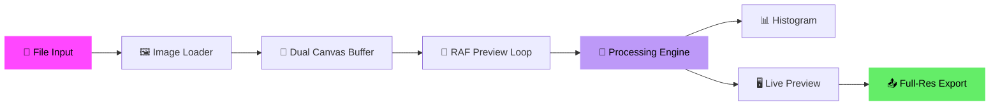

<div align="center">

<!-- Animated Header -->


<!-- Animated Badges -->
<p>
  
  
  
  
</p>

<p>
  
  
  
  
</p>

<!-- Animated Typing Effect -->
<a href="https://git.io/typing-svg">
  
</a>

<br />

<!-- Animated Divider -->


</div>

## 🌟 Overview

**PixelCraft Studio** is a powerful, privacy-first image editing toolkit that runs **entirely in your browser**. No uploads, no servers, no data collection — just pure client-side image processing powered by Canvas API and WebAssembly AI models.

<div align="center">

```
🔒 Your photos never leave your device
⚡ 60fps real-time preview with RAF engine
🧠 WASM/ONNX neural network for AI features
🎨 Professional-grade color grading tools
```

</div>

---

## 🚀 Features

<table>
<tr>
<td width="50%">

### 🎛️ Toolkit Studio (`/studio`)

| Tool | Description |
|:---|:---|
| ✨ **Enhance** | Brightness, contrast, saturation, sharpness, warmth, exposure & vibrance |
| 📦 **Compress** | Quality slider for WebP/JPG/PNG with real-time file size readout |
| 🔇 **Denoise** | Spatial Median & Bilateral Gaussian filters for ISO grain removal |
| 🎮 **Pixelate** | 8-bit retro art with GameBoy, NES, Cyberpunk & C64 color palettes |
| ✂️ **Remove BG** | AI-powered subject segmentation with custom backdrop options |

</td>
<td width="50%">

### 🎨 Pro Color Editor (`/editor`)

| Feature | Description |
|:---|:---|
| 💡 **Light** | Exposure, contrast, highlights, shadows, whites & blacks |
| 🌈 **Color** | Temperature, tint, vibrance & saturation |
| 🎚️ **HSL Mixer** | 8-channel per-color H/S/L control |
| ✨ **Effects** | Texture, clarity, dehaze, vignette & grain |
| 🖌️ **Masking** | AI subject, radial, linear & brush masks |
| 🎭 **Presets** | One-click professional preset styles |

</td>
</tr>
</table>

---

## ⚡ Architecture

<div align="center">



</div>

**Key Design Decisions:**

- 🏎️ **60fps Preview** — Downscaled canvas (max 1200px) with `requestAnimationFrame` loop
- 🖼️ **Full-Res Export** — Processes at original resolution only on export
- 🧹 **Memory Safe** — Proper `URL.revokeObjectURL()` cleanup to avoid blob leaks
- 🧠 **WASM AI** — `@imgly/background-removal` for neural network segmentation
- 📁 **Multi-File Queue** — Thumbnail queue with file switching

---

## 🛠️ Tech Stack

<div align="center">

| Technology | Purpose |
|:---:|:---|
|  | App Router framework |
|  | UI library with hooks |
|  | Type-safe development |
|  | Utility-first CSS |
|  | AI model runtime |
|  | Image pixel processing |
|  | Icon system |

</div>

---

## 📦 Quick Start

```bash
# Clone the repository
git clone git@github.com:AwanSaputra3/pixelcraft.git
cd pixelcraft

# Install dependencies
npm install

# Start development server
npm run dev
```

Open [http://localhost:3000](http://localhost:3000) in your browser ✨

---

## 📁 Project Structure

```
src/
├── app/
│   ├── layout.tsx              # Root layout (Mulish + Inter fonts)
│   ├── page.tsx                # Landing page with hero & feature cards
│   ├── globals.css             # Design system (glassmorphism, starry bg)
│   ├── studio/page.tsx         # 🎛️ Toolkit Studio (5 image tools)
│   └── editor/page.tsx         # 🎨 Pro Color Editor (Lightroom-style)
├── components/
│   ├── Header.tsx              # Sticky nav with sample image selector
│   ├── Dropzone.tsx            # Drag & drop + file queue
│   ├── ControlBar.tsx          # Studio tool tabs & sliders
│   ├── ImageCompare.tsx        # Before/After comparison slider
│   ├── ExportModal.tsx         # Download modal (format, quality)
│   ├── HistogramCanvas.tsx     # Live RGB histogram
│   └── lightroom/
│       ├── LightroomCanvas.tsx         # Editor canvas
│       ├── LightroomControlBar.tsx     # Full control panel
│       ├── HslMixer.tsx                # 8-channel HSL mixer
│       ├── MaskingPanel.tsx            # Selective masking tools
│       └── PresetsPanel.tsx            # Preset styles
└── lib/
    ├── enhance.ts              # Brightness, contrast, sharpness engine
    ├── compress.ts             # WebP/JPG/PNG compression
    ├── denoise.ts              # Median & Bilateral Gaussian filters
    ├── pixelate.ts             # Retro pixel art quantizer
    ├── removeBg.ts             # WASM AI background removal
    └── lightroomEngine.ts      # Pro color grading (684 lines)
```

---

## 🎨 Design System

The UI follows a **dark glassmorphism** design language:

<div align="center">

| Token | Value | Usage |
|:---|:---|:---|
| `--color-bg` | `#121212` | Primary background |
| `--color-accent` | `#ff47ff` | CTAs, brand highlights |
| `--color-secondary` | `#ffc13c` | Secondary accents |
| `--color-text` | `#ffffff` | Primary text |
| `--color-surface` | `#1c1c1c` | Cards, panels |
| `--radius` | `12px+` | Rounded corners |
| `--font` | `Mulish` | All typography |

</div>

> 📖 See [`design.md`](./design.md) for the complete design system reference.

---

## 🔐 Privacy First

<div align="center">

```
┌─────────────────────────────────────────────┐
│                                             │
│   🖥️  YOUR BROWSER                          │
│                                             │
│   ┌───────────┐    ┌──────────────────┐     │
│   │ Your Photo│───▶│ Canvas API /     │     │
│   │  (Local)  │    │ WASM Processing  │     │
│   └───────────┘    └──────────────────┘     │
│                            │                │
│                            ▼                │
│                    ┌──────────────┐          │
│                    │ Download to  │          │
│                    │  Your Device │          │
│                    └──────────────┘          │
│                                             │
│   ❌ No server uploads                       │
│   ❌ No data collection                      │
│   ❌ No third-party tracking                 │
│   ✅ 100% client-side processing             │
│                                             │
└─────────────────────────────────────────────┘
```

</div>

---

## 📝 Available Scripts

| Command | Description |
|:---|:---|
| `npm run dev` | Start development server |
| `npm run build` | Build for production |
| `npm start` | Start production server |
| `npm run lint` | Run ESLint |

---

## 🤝 Contributing

Contributions are welcome! Feel free to open issues and pull requests.

1. Fork the repository
2. Create your feature branch (`git checkout -b feature/amazing-feature`)
3. Commit your changes (`git commit -m 'Add amazing feature'`)
4. Push to the branch (`git push origin feature/amazing-feature`)
5. Open a Pull Request

---

## 📄 License

This project is open source and available under the [MIT License](LICENSE).

---

<div align="center">

<!-- Animated Footer -->


<p>
  <strong>Built with 💜 by the PixelCraft Studio Team</strong>
</p>

<p>
  
</p>

</div>
